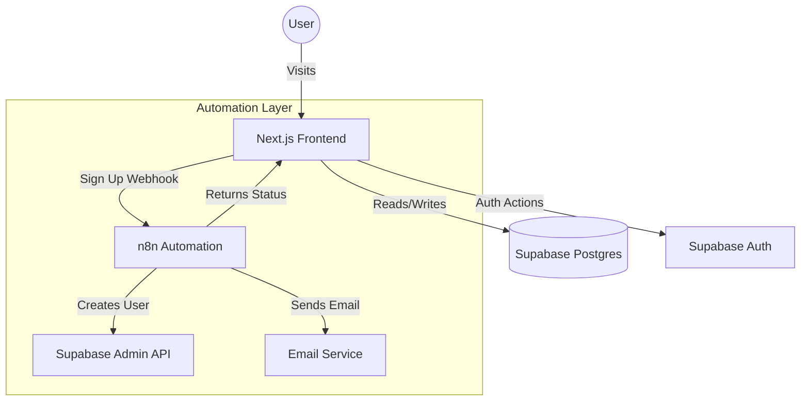

<div align="center">

# ✦ PORTAL
> *The Personal Operating System for High-Performance Living.*


</div>

---

**PORTAL** is a next-generation life management dashboard designed with a cinematic, high-end aesthetic. It serves as a centralized hub for tracking performance, managing habits, setting goals, and archiving personal wisdom. Built with modern web technologies, it prioritizes fluid animations, dark-mode-first design, and seamless user experience.

If you want a personal, single-user dashboard that feels premium, fast, and alive, this is it.

---

## 🏗️ Architecture

The system is built on a decoupled architecture leveraging powerful automation and serverless databases.



### Core Components
- **Frontend**: Next.js 16 (React 18) with TypeScript.
- **Styling**: Tailwind CSS + Shadcn UI + Framer Motion (animations).
- **Backend & Database**: Supabase (PostgreSQL, Auth, Realtime).
- **Automation**: n8n (for complex workflows like User Sign-up & Verification).

---

## ✨ Key Features

### 🔐 Cinematic Authentication
- **Custom Auth Flow**: Replaces standard forms with a visually immersive "Portal Entry" experience.
- **n8n Integration**: User registration is handled via a secure webhook to n8n, allowing for complex validation, email dispatch, and token generation before the user is created in Supabase.
- **Conflict Resolution**: Smart handling of existing accounts (e.g., prompting Google Login if the email is already registered).

### 📊 Performance Dashboard
- **Habit Tracking**: Visual streak indicators with importance weighting.
- **Cycle Goals**: Accordion-style goal management for focusing on quarterly objectives.
- **Analytics**: Interactive `Recharts` visualization of performance metrics over time.

### 🗃️ Archives
- **Life Checklist**: A markdown-based system for tracking life achievements.
- **Mantra Bank**: A minimalist interface for storing and reviewing personal principles.

---

## 🛠️ Tech Stack

| Category | Technology | Usage |
|----------|------------|-------|
| **Framework** | Next.js 16 | App Router, Server Components |
| **Language** | TypeScript | Type safety across the app |
| **Styling** | Tailwind CSS | Utility-first styling |
| **UI Library** | Shadcn UI | Accessible, reusable components |
| **Icons** | Lucide React | Consistent iconography |
| **Charts** | Recharts | Data visualization |
| **Database** | Supabase | PostgreSQL, Row Level Security (RLS) |
| **Auth** | Supabase Auth | JWT-based session management |
| **Automation** | n8n | Backend logic flows |

---

## 🚀 Getting Started

### Prerequisites
- Node.js (v18+)
- npm or pnpm
- A Supabase project
- An n8n instance (Cloud or Self-hosted)

### Installation

1.  **Clone the repository:**
    ```bash
    git clone https://github.com/yourusername/el-portal.git
    cd el-portal
    ```

2.  **Install dependencies:**
    ```bash
    npm install
    # or
    pnpm install
    ```

3.  **Environment Setup:**
    Create a `.env.local` file in the root directory:
    ```env
    NEXT_PUBLIC_SUPABASE_URL=your_supabase_project_url
    NEXT_PUBLIC_SUPABASE_ANON_KEY=your_supabase_anon_key
    ```
    *(Note: The n8n webhook URL is currently configured in `src/components/PortalEntry.tsx`)*

4.  **Run Development Server:**
    ```bash
    npm run dev
    ```
    Open [http://localhost:3000](http://localhost:3000) to view the portal.

---

## 📂 Project Structure

```bash
el-portal/
├── src/
│   ├── app/                 # Next.js App Router pages
│   │   ├── (portal)/        # Protected routes (Dashboard, Archives, etc.)
│   │   ├── verify-email/    # Public email verification page
│   │   └── page.tsx         # Landing / Entry page
│   ├── components/
│   │   ├── auth/            # Auth-related components (SignUp, Login, Layouts)
│   │   ├── ui/              # Shadcn UI primitives (Buttons, Inputs, etc.)
│   │   └── ...              # Widget components (Habits, Goals)
│   ├── lib/
│   │   └── supabase.ts      # Supabase client initialization
│   └── types/               # TypeScript definitions
└── public/                  # Static assets
```

---

## 🔄 Authentication Logic Details

1.  **User submits Sign Up form:**
    - Frontend sends `POST` request to n8n Webhook.
2.  **n8n Workflow:**
    - Checks if user exists.
    - If **Yes**: Returns `409 Conflict`. Frontend shows "Account Already Exists".
    - If **No**:
        - Creates user in Supabase (with `email_confirm: false`).
        - Generates a crypto token.
        - Saves token to `email_validation_tokens` table via RPC.
        - Sends Custom HTML Email with verification link.
        - Returns `200 OK` to Frontend.
3.  **User clicks Email Link:**
    - Redirects to `/verify-email?token=...&email=...`
    - Frontend verifies token against database.
    - If valid, updates user to `email_confirmed: true` and redirects to Dashboard.

---

<div align="center">

*Verified & Documented by System.*

</div>
